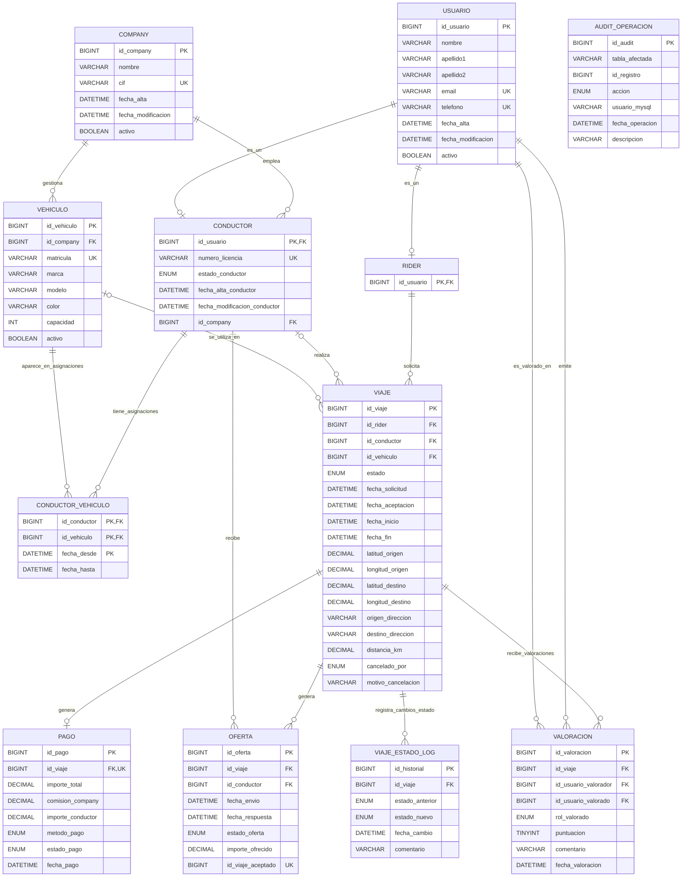

# DISEÑO DE LA BASE DE DATOS

## 1. Docker

Para desplegar la base de datos se ha usado Docker Compose. El objetivo es poder levantar MySQL 8 de forma sencilla y reproducible, sin depender de una instalación local.

El servicio principal es `mysql`, basado en la imagen `mysql:8.0`:

```yaml
services:
  mysql:
    image: mysql:8.0
    container_name: mysql8
```

También se ha configurado:

```
restart: unless-stopped
```

Con esto, Docker reinicia el contenedor si se detiene inesperadamente, salvo que se haya parado manualmente.

### 1.1 Puerto de conexión

Se publica el puerto estándar de MySQL:

```
ports:
  - "3306:3306"
```

Esto permite conectarse a la base de datos desde la máquina local usando `127.0.0.1:3306`.

### 1.2 Variables de entorno

Las credenciales iniciales no se escriben directamente en el `compose.yml`, sino en un archivo `.env`:

```
MYSQL_ROOT_PASSWORD=rootpass
MYSQL_DATABASE=ride_hailing
MYSQL_USER=app_user
MYSQL_PASSWORD=app_password
```

Y en el `compose.yml` se usan así:

```
environment:
  MYSQL_ROOT_PASSWORD: ${MYSQL_ROOT_PASSWORD}
  MYSQL_DATABASE: ${MYSQL_DATABASE}
  MYSQL_USER: ${MYSQL_USER}
  MYSQL_PASSWORD: ${MYSQL_PASSWORD}
```

Con esto se crea inicialmente la base de datos `ride_hailing` y un usuario básico `app_user`. Los roles y permisos específicos del proyecto se definen después en los scripts SQL.

### 1.3 Persistencia de datos

Se usa un volumen de Docker para guardar los datos de MySQL:

```
volumes:
  - mysql_data:/var/lib/mysql
```

Así, si el contenedor se borra o se recrea, los datos no se pierden mientras se mantenga el volumen `mysql_data`.

### 1.4 Configuración personalizada

También se monta una carpeta local de configuración:

```
- ./mysql/conf.d:/etc/mysql/conf.d:ro
```

Esta carpeta permite añadir archivos .cnf con configuración personalizada de MySQL. Se monta en modo solo lectura (`:ro`) para evitar modificaciones accidentales desde el contenedor.

#### 1.4.1 Archivo `custom.cnf`

Además del volumen de datos, se incluye un archivo `custom.cnf` propio para MySQL en `mysql/conf.d`. 

Este archivo se monta dentro del contenedor `/etc/mysql/conf.d`, por lo que MySQL lo lee automáticamente al arrancar. Su objetivo es fijar ciertos parámetros del servidor relacionados con validación de datos, logs, rendimiento, binary log, monitorización, etc.

##### Sección del servidor

```
[mysqld]
``` 

Esta sección indica que las opciones siguientes se aplican al servidor MySQL.

##### Validación de datos

``` 
sql_mode=STRICT_TRANS_TABLES,ERROR_FOR_DIVISION_BY_ZERO,NO_ENGINE_SUBSTITUTION
```

Este parámetro controla cómo valida MySQL ciertas operaciones.

`STRICT_TRANS_TABLES` hace que se rechacen datos inválidos en lugar de aceptarlos con conversiones automáticas.

`ERROR_FOR_DIVISION_BY_ZERO` trata las divisiones por cero como error.

`NO_ENGINE_SUBSTITUTION` evita que MySQL sustituya automáticamente el motor de almacenamiento solicitado si no está disponible.

##### Logs de diagnóstico

```
log_error_verbosity=3
```

Este parámetro aumenta el nivel de detalle del log de errores. Sirve para diagnosticar problemas de arranque, configuración o ejecución del servidor.

```
slow_query_log=1
long_query_time=0.5
```

`slow_query_log=1` activa el registro de consultas lentas.

`long_query_time=0.5` indica que se registran las consultas que tardan más de 0,5 segundos.

Esto permite detectar consultas poco eficientes, especialmente en el dashboard o en consultas de análisis.

##### Rendimiento básico

```
innodb_buffer_pool_size=256M
max_connections=200
```

`innodb_buffer_pool_size` reserva memoria para que InnoDB almacene en caché datos e índices.

`max_connections` establece el número máximo de conexiones simultáneas permitidas por el servidor.

##### Durabilidad de transacciones

```
innodb_flush_log_at_trx_commit=1
```

Este parámetro hace que el redo log se escriba en disco en cada `COMMIT`. Con ello se reduce el riesgo de perder transacciones confirmadas si el servidor se detiene inesperadamente.

##### Binary log y recuperación

```
server_id=1
```

Este identificador es necesario cuando se usa binary log y también sería obligatorio en escenarios de replicación.

```
log_bin=mysql-bin
binlog_format=ROW
sync_binlog=1
binlog_expire_logs_seconds=604800
```

`log_bin=mysql-bin` activa el binary log, que registra cambios realizados sobre los datos.

`binlog_format=ROW` guarda los cambios fila a fila, lo que resulta adecuado para recuperación y replicación.

`sync_binlog=1` sincroniza el binary log con disco en cada `COMMIT`, aumentando la seguridad ante fallos.

`binlog_expire_logs_seconds=604800` conserva los binlogs durante 604800 segundos (i.e. 7 días).

Esta configuración permite plantear una recuperación PITR, combinando un backup completo con los cambios registrados posteriormente en los binlogs.

##### Monitorización

```
performance_schema=1
```

`performance_schema` permite consultar métricas internas de MySQL, como esperas, bloqueos, transacciones y datos de rendimiento. Esto sirve como apoyo para la monitorización y el diagnóstico del servidor.

### 1.5 Healthcheck

Se ha añadido un healthcheck para comprobar que MySQL está listo para aceptar conexiones:

```
healthcheck:
  test: ["CMD-SHELL", "mysqladmin ping -h 127.0.0.1 -uroot -p$${MYSQL_ROOT_PASSWORD}"]
  interval: 10s
  timeout: 5s
  retries: 10
```
Esto evita considerar el contenedor como operativo antes de que el servidor MySQL haya terminado de arrancar.

## 2. Tabla entidad-relación

### 2.1 Diagrama Entidad-Relación (MER)

El siguiente diagrama muestra la estructura de la base de datos, destacando las relaciones, la especialización de usuarios y el flujo de los viajes y pagos.



### 2.2 Descripción de tablas

#### `company`

La tabla `company` almacena las empresas que operan en la plataforma. Cada conductor y cada vehículo pertenecen a una company.

El campo `cif` tiene una restricción `UNIQUE`, ya que no pueden existir dos companies con el mismo identificador fiscal.

Los campos `fecha_alta`, `fecha_modificacion` y `activo` permiten registrar cuándo se creó la company, cuándo se modificó por última vez y si sigue operativa en el sistema.

#### `usuario`

La tabla `usuario` almacena la información de todas las personas registradas en el sistema, independientemente de si actúan como riders o como conductores.

Los campos `email` y `telefono` tienen restricciones `UNIQUE`, ya que representan datos personales que no deben repetirse entre usuarios.

A partir de esta tabla, se especializan los usuarios mediante las tablas `rider` y `conductor`.

#### `rider`

La tabla `rider` representa a los usuarios que pueden solicitar viajes.

Su clave primaria es clave foránea de `usuario(id_usuario)`. Esto implementa una relación por la que un rider siempre debe existir previamente como usuario. No puede existir un rider sin un usuario enlazado al mismo.

La acción `ON DELETE RESTRICT` impide borrar un usuario si está registrado como rider, protegiendo la integridad de los datos.

#### `conductor`

La tabla `conductor` representa a los usuarios que pueden recibir ofertas y realizar viajes.

Su clave primaria también referencia a `usuario(id_usuario)`. Además, cada conductor pertenece obligatoriamente a una compañía mediante `id_company` que es una clave foránea hacia `company(id_company)`.

El campo `numero_licencia` es único, ya que identifica el permiso de conducción de cada conductor. El campo `estado_conductor` permite controlar su disponibilidad mediante los valores `disponible`, `en_viaje`, `desconectado` y `suspendido`, algo que nos permitirá realizar comprobaciones en los procedimientos almacenados.

La tabla incluye índices sobre `id_company` y `estado_conductor`, ya que son columnas frecuentes en consultas, especialmente para localizar conductores disponibles por empresa o estado.

#### `vehiculo`

La tabla `vehiculo` almacena los vehículos gestionados por las compañías. Cada vehículo pertenece a una compañía.

La matrícula se define como única, ya que identifica al vehículo y no puede estar duplicada. La columna `capacidad` tiene una restricción que obliga a que su valor sea mayor que cero, evitando datos imposibles.

El campo `activo` permite distinguir vehículos operativos de vehículos dados de baja sin necesidad de eliminarlos físicamente.

#### `conductor_vehiculo`

La tabla `conductor_vehiculo` resuelve la relación muchos a muchos entre conductores y vehículos.

Un conductor puede tener asignados distintos vehículos a lo largo del tiempo, y un mismo vehículo puede haber sido utilizado por distintos conductores. Por eso se utiliza esta tabla intermedia.

La clave primaria compuesta está formada por `id_conductor`, `id_vehiculo` y `fecha_desde`, lo que permite registrar varias asignaciones históricas entre el mismo conductor y el mismo vehículo en momentos diferentes sin que estos estén duplicados.

Cuando `fecha_hasta` es `NULL`, la asignación se considera vigente. Los índices sobre `(id_conductor, fecha_hasta)` y `(id_vehiculo, fecha_hasta)` ayudan a localizar rápidamente las asignaciones activas.

#### `viaje`

La tabla `viaje` representa el ciclo de vida completo de un trayecto solicitado por un rider. Cada viaje pertenece obligatoriamente a un rider.

Las columnas `id_conductor` y `id_vehiculo` pueden ser NULL porque un viaje puede existir inicialmente en estado `solicitado`, antes de que haya sido aceptado por un conductor. Cuando el viaje es aceptado, se asignan el conductor y el vehículo correspondientes.

El campo `estado` controla cómo va avanzando el viaje mediante los valores `solicitado`, `aceptado`, `en_curso`, `finalizado` y `cancelado`.

La tabla también almacena fechas relevantes del ciclo de vida del viaje: solicitud, aceptación, inicio y fin. Además, guarda coordenadas y direcciones de origen y destino.

Se incluyen restricciones para validar que las latitudes estén entre `-90` y `90`, las longitudes entre `-180` y `180`, y que la distancia no sea negativa.

Los índices sobre estado, conductor y rider permiten optimizar consultas frecuentes, como buscar viajes por estado, historial de un conductor o historial de un rider.

#### `oferta`

La tabla `oferta` almacena las ofertas enviadas a los conductores para un viaje. Cada oferta pertenece a un viaje y a un conductor. 

La restricción `UNIQUE (id_viaje, id_conductor)` impide que el mismo conductor reciba más de una vez la misma oferta para el mismo viaje.

El campo `estado_oferta` permite controlar si la oferta está `pendiente`, `aceptada`, `rechazada` o `expirada`.

Para garantizar que solo pueda existir una oferta aceptada por viaje, se utiliza la columna generada `id_viaje_aceptado`. Esta columna solo toma valor cuando la oferta está aceptada.

De esta forma, pueden existir muchas ofertas pendientes, rechazadas o expiradas para un viaje, pero solo una oferta aceptada.

#### `pago`

La tabla `pago` almacena la transacción económica de un viaje finalizado.

La columna `id_viaje` es clave foránea hacia `viaje(id_viaje)` y además tiene una restricción `UNIQUE`, lo que garantiza que cada viaje pueda tener como máximo un pago asociado.

La tabla registra el importe total pagado, la comisión de la compañía y el importe correspondiente al conductor. La restricción `ck_pago_sumas` comprueba que el total sea coherente con la suma de la comisión y el importe del conductor, admitiendo una pequeña tolerancia por redondeos.

También se valida que los importes no puedan ser negativos mediante restricciones `CHECK`.

El campo `metodo_pago` limita los métodos permitidos a `tarjeta_credito`, `efectivo` y `wallet`, mientras que `estado_pago` controla si el pago está `pendiente`, `completado`, `fallido` o `reembolsado`.

#### `valoracion`

La tabla `valoracion` almacena las valoraciones emitidas por los usuarios tras un viaje. Cada valoración se asocia a un viaje. Además, registra quién emite la valoración y quién la recibe.

El campo `rol_valorado` indica si el usuario valorado actúa como `rider` o como `conductor` ya que los riders pueden valorar al conductor y viceversa. 

La puntuación se restringe mediante un `CHECK` para que solo pueda tomar valores entre 1 y 5.

El índice sobre `(id_usuario_valorado, fecha_valoracion)` facilita consultas de reputación o rankings.

#### `viaje_estado_log`

La tabla `viaje_estado_log` registra el historial de cambios de estado de los viajes. Cada fila almacena el viaje afectado, el estado anterior, el nuevo estado, la fecha del cambio y un comentario descriptivo.

Esta tabla se actualiza automáticamente mediante el trigger `tr_audit_viaje_estado`, que inserta un registro cada vez que el campo `estado` de un viaje cambia.

Su objetivo es proporcionar trazabilidad funcional del ciclo de vida de los viajes.

#### `audit_operacion`

La tabla `audit_operacion` almacena una auditoría general de operaciones relevantes.

A diferencia de `viaje_estado_log`, que se centra únicamente en cambios de estado de viajes, esta tabla registra operaciones más generales sobre viajes, ofertas y pagos.

Cada registro incluye la tabla afectada, el identificador del registro, la acción realizada, el usuario que ejecutó la operación, la fecha y una breve descripción.

Esta tabla no tiene claves foráneas directas hacia las tablas ya que se referencia a `tabla_afectada` e `id_registro`. Esto permite auditar operaciones de distintas tablas dentro de una misma estructura.

### 2.3 Relaciones entre tablas

Las relaciones principales de la base de datos se pueden resumir mediante las siguientes cardinalidades:

| Relación | Cardinalidad | Descripción |
| --- | --- | --- |
| `company` — `conductor` | 1:N | Una company puede tener muchos conductores, pero cada conductor pertenece a una única company. |
| `company` — `vehiculo` | 1:N | Una company puede gestionar muchos vehículos, pero cada vehículo pertenece a una única company. |
| `usuario` — `rider` | 1:0..1 | Un usuario puede ser rider o no serlo. Cada rider debe existir previamente como usuario. |
| `usuario` — `conductor` | 1:0..1 | Un usuario puede ser conductor o no serlo. Cada conductor debe existir previamente como usuario. |
| `conductor` — `vehiculo` | N:M | Un conductor puede usar varios vehículos y un vehículo puede estar asignado a varios conductores. Se resuelve mediante `conductor_vehiculo`. |
| `rider` — `viaje` | 1:N | Un rider puede solicitar muchos viajes, pero cada viaje pertenece a un único rider. |
| `conductor` — `viaje` | 1:N opcional | Un conductor puede realizar muchos viajes, pero un viaje puede no tener conductor al principio. |
| `vehiculo` — `viaje` | 1:N opcional | Un vehículo puede utilizarse en muchos viajes, pero un viaje puede no tener vehículo al principio. |
| `viaje` — `oferta` | 1:N | Un viaje puede generar varias ofertas, pero cada oferta pertenece a un único viaje. |
| `conductor` — `oferta` | 1:N | Un conductor puede recibir muchas ofertas, pero cada oferta se envía a un único conductor. |
| `viaje` — `pago` | 1:0..1 | Un viaje puede tener como máximo un pago asociado. |
| `viaje` — `valoracion` | 1:N | Un viaje puede tener varias valoraciones asociadas. |
| `usuario` — `valoracion` | 1:N | Un usuario puede emitir y recibir muchas valoraciones. |
| `viaje` — `viaje_estado_log` | 1:N | Un viaje puede tener varios registros de cambio de estado. |
| `audit_operacion` — tablas auditadas | Relación lógica | No usa claves foráneas directas; identifica la tabla y el registro mediante `tabla_afectada` e `id_registro`. |

## 3. Roles y permisos

La seguridad de la base de datos se ha organizado mediante roles de MySQL. En lugar de conceder permisos directamente a cada usuario, se definen roles con permisos concretos y después se asignan esos roles a usuarios específicos.

El objetivo principal es aplicar el principio de mínimos privilegios, cada usuario solo debe tener los permisos necesarios para cumplir su función.

### 3.1 Roles definidos

En el script se crean cinco roles principales:

```sql
CREATE ROLE IF NOT EXISTS 'rol_admin';
CREATE ROLE IF NOT EXISTS 'rol_app';
CREATE ROLE IF NOT EXISTS 'rol_analista';
CREATE ROLE IF NOT EXISTS 'rol_backup';
CREATE ROLE IF NOT EXISTS 'rol_readonly';
```

Cada rol representa un perfil distinto dentro del sistema.

#### `rol_admin`

El rol `rol_admin` tiene control total sobre la base de datos.

Es el rol con más permisos, por lo que no debe usarse para la aplicación ni para consultas normales.

#### `rol_app`

El rol `rol_app` está pensado para el usuario que utiliza la aplicación backend.

Este rol puede consultar las vistas que tiene asignadas, insertar valoraciones y ejecutar los procedimientos almacenados para realizar el flujo de datos dentro de la base de datos.

#### `rol_analista`

El rol `rol_analista` está pensado para consultas de análisis y métricas.

Tiene permisos de solo lectura sobre vistas preparadas con datos relevantes para el análisis de los mismos y la detección de problemas tanto a nivel de app como de usuario.

Este rol puede consultar información útil para el análisis del sistema, pero sin acceder directamente a datos personales sensibles ni modificar información.

#### `rol_readonly`

El rol `rol_readonly` permite consultar información básica y general del sistema sin capacidad de escritura ni modificación.

Tiene únicamente acceso de lectura a vistas operativas que le han sido asignadas.

Este rol está pensado para usuarios que solo necesitan revisar datos de una manera simple y rápida.

#### `rol_backup`

El rol `rol_backup` tiene permisos que le permiten crear y restaurar copias de seguridad de la base de datos y de la información que contiene.

### 3.2 Usuarios creados

El script crea un usuario para cada rol:

| Usuario | Rol asignado | Finalidad |
| --- | --- | --- |
| `admin_user`    | `rol_admin`    | Administración completa del esquema.             |
| `backend_user`  | `rol_app`      | Usuario utilizado por la aplicación backend.     |
| `analyst_user`  | `rol_analista` | Consultas analíticas y métricas.                 |
| `readonly_user` | `rol_readonly` | Consulta general sin permisos de escritura.      |
| `backup_user`   | `rol_backup`   | Creación de backups y soporte a recuperación. |

A cada usuario se le asigna su rol correspondiente mediante `GRANT`.

Además, se establece el rol como rol por defecto haciendo uso de `SET DEFAULT ROLE`. Esto permite que el usuario tenga activo su rol automáticamente al iniciar sesión, sin tener que ejecutar manualmente `SET ROLE`.
## 4. Vistas e Índices

En el proyecto se han creado vistas para controlar el acceso a la información y simplificar algunas consultas frecuentes. Además, se han definido índices para mejorar el rendimiento de las búsquedas, joins y consultas operativas más habituales.

Las vistas se definen en `permissions.sql`, mientras que los índices principales se crean en `schema.sql` junto con las tablas.

### 4.1 Vistas creadas

Las vistas permiten mostrar solo la información necesaria para cada tipo de usuario. De esta forma, no hace falta conceder acceso directo a todas las tablas base.

En este proyecto las vistas se han organizado según el rol que las utiliza. Esto permite separar mejor las responsabilidades de cada usuario y aplicar el principio de mínimos privilegios.

| Vista | Finalidad | Roles con acceso funcional |
| --- | --- | --- |
| `v_app_conductores_disponibles` | Muestra conductores activos y disponibles para recibir viajes. | `rol_app` |
| `v_app_viajes_operativos` | Muestra información operativa de los viajes. | `rol_app` |
| `v_app_ofertas_operativas` | Muestra información operativa de las ofertas. | `rol_app` |
| `v_app_pagos_operativos` | Muestra información básica de los pagos. | `rol_app` |
| `v_analyst_usuarios_anonimizados` | Permite consultar usuarios sin exponer datos sensibles como `email` o `telefono`. | `rol_analista` |
| `v_analyst_viajes_detalle` | Muestra información detallada de viajes, incluyendo conductor, company y duración. | `rol_analista` |
| `v_analyst_ofertas_detalle` | Muestra información detallada de las ofertas, incluyendo conductor y company. | `rol_analista` |
| `v_analyst_tasa_aceptacion_conductor` | Calcula la tasa de aceptación de ofertas por conductor. | `rol_analista` |
| `v_analyst_tasa_aceptacion_company` | Calcula la tasa de aceptación de ofertas por company. | `rol_analista` |
| `v_analyst_ingresos_conductor` | Resume ingresos, kilómetros e ingresos por kilómetro de cada conductor. | `rol_analista` |
| `v_analyst_ingresos_company` | Resume ingresos, comisiones y kilómetros asociados a cada company. | `rol_analista` |
| `v_analyst_pagos_detalle` | Muestra información económica detallada de los pagos y su relación con viajes, conductores y companies. | `rol_analista` |
| `v_analyst_valoraciones` | Permite analizar las valoraciones recibidas por los usuarios. | `rol_analista` |
| `v_analyst_viaje_estado_log` | Muestra el historial de cambios de estado de los viajes. | `rol_analista` |
| `v_analyst_auditoria_operaciones` | Permite revisar operaciones auditadas sin acceder directamente a la tabla `audit_operacion`. | `rol_analista` |
| `v_readonly_companies` | Muestra información básica de las companies. | `rol_readonly` |
| `v_readonly_conductores` | Muestra conductores sin exponer datos privados. | `rol_readonly` |
| `v_readonly_vehiculos` | Muestra vehículos sin información sensible. | `rol_readonly` |
| `v_readonly_viajes_resumen` | Muestra un resumen básico de los viajes. | `rol_readonly` |
| `v_readonly_viajes_por_estado` | Resume cuántos viajes hay en cada estado. | `rol_readonly` |

#### `v_app_conductores_disponibles`

Esta vista combina las tablas `conductor`, `usuario` y `company`.

Muestra únicamente conductores cuyo usuario está activo y cuyo estado es `disponible`.

Su objetivo es permitir que la aplicación consulte qué conductores pueden recibir nuevas ofertas sin acceder directamente a las tablas base.

Incluye el identificador del conductor, la company a la que pertenece, el nombre del conductor y su estado.

#### `v_app_viajes_operativos`

Esta vista muestra la información principal de los viajes desde un punto de vista operativo.

Incluye el identificador del viaje, rider, conductor, vehículo, estado, fechas principales, direcciones de origen y destino, y distancia.

Sirve para que la aplicación pueda consultar el estado y evolución de los viajes sin necesidad de acceder directamente a la tabla `viaje`.

#### `v_app_ofertas_operativas`

Esta vista muestra la información principal de las ofertas enviadas a conductores.

Incluye el viaje asociado, el conductor, la fecha de envío, la fecha de respuesta, el estado de la oferta y el importe ofrecido.

Permite consultar el ciclo operativo de las ofertas sin exponer toda la tabla base.

#### `v_app_pagos_operativos`

Esta vista muestra información básica de los pagos asociados a los viajes.

Incluye el identificador del pago, el viaje asociado, el importe total, el método de pago, el estado del pago y la fecha de pago.

Está pensada para que la aplicación pueda consultar el estado básico de los pagos sin acceder a todos los detalles económicos de la tabla `pago`.

#### `v_analyst_usuarios_anonimizados`

Esta vista se crea a partir de la tabla `usuario`, pero no incluye los campos `email` ni `telefono`.

Su objetivo es permitir análisis sobre usuarios sin exponer datos personales sensibles.

Por eso se concede al rol `rol_analista`, que necesita información general de usuarios para realizar métricas, pero no necesita acceder a sus datos privados.

#### `v_analyst_viajes_detalle`

Esta vista muestra información detallada de los viajes.

Combina la tabla `viaje` con `conductor`, `usuario` y `company`, de forma que permite analizar cada viaje junto con el conductor asignado y la company correspondiente.

Además, calcula la duración del viaje en minutos mediante `TIMESTAMPDIFF`, usando `fecha_inicio` y `fecha_fin`.

Es útil para métricas de duración media, kilometraje medio, evolución de viajes y análisis del funcionamiento general del sistema.

#### `v_analyst_ofertas_detalle`

Esta vista muestra información detallada de las ofertas.

Relaciona cada oferta con su conductor y la company a la que pertenece.

Permite analizar qué ofertas se han enviado, a qué conductores, en qué estado se encuentran y qué importe se ofreció.

Sirve como base para estudiar la aceptación, rechazo o expiración de ofertas.

#### `v_analyst_tasa_aceptacion_conductor`

Esta vista calcula la tasa de aceptación de ofertas por conductor.

Para cada conductor se obtiene el total de ofertas recibidas, el número de ofertas aceptadas y el porcentaje de aceptación.

La tasa se calcula como `ofertas_aceptadas / total_ofertas * 100`.

Se usa `NULLIF` para evitar divisiones por cero en caso de que no existan ofertas.

Esta vista permite comparar el comportamiento de los conductores y detectar conductores con tasas de aceptación bajas o altas.

#### `v_analyst_tasa_aceptacion_company`

Esta vista calcula la tasa de aceptación de ofertas agrupada por company.

A diferencia de la vista anterior, no analiza a cada conductor individualmente, sino el comportamiento agregado de todos los conductores de una misma company.

Permite comparar el rendimiento operativo entre companies y detectar diferencias en la aceptación de viajes.

#### `v_analyst_ingresos_conductor`

Esta vista resume los ingresos asociados a cada conductor.

Para cada conductor muestra el número total de pagos, los ingresos totales, el importe correspondiente al conductor, los kilómetros totales y los euros por kilómetro.

Su objetivo es permitir análisis económicos por conductor, relacionando los pagos con la distancia recorrida.

Solo deben considerarse pagos completados, ya que los pagos pendientes, fallidos o reembolsados no representan ingresos efectivos.

#### `v_analyst_ingresos_company`

Esta vista resume los ingresos asociados a cada company.

Relaciona pagos, viajes, conductores y companies para calcular el número total de pagos, los ingresos totales, la comisión obtenida por la company, los kilómetros totales y los euros por kilómetro.

Permite analizar la rentabilidad de cada company dentro de la plataforma.

Igual que en la vista de ingresos por conductor, solo deben considerarse pagos completados.

#### `v_analyst_pagos_detalle`

Esta vista muestra información económica detallada de los pagos.

Combina la tabla `pago` con `viaje`, `conductor`, `usuario` y `company`.

Incluye importes, comisión de la company, importe del conductor, método de pago, estado del pago, distancia del viaje y duración en minutos.

Sirve para análisis económico más completo, ya que relaciona cada pago con el viaje y el conductor correspondiente.

#### `v_analyst_valoraciones`

Esta vista muestra las valoraciones recibidas por los usuarios.

Incluye el viaje asociado, el usuario valorado, su nombre, el rol valorado, la puntuación y la fecha de valoración.

Permite analizar la calidad del servicio, tanto desde el punto de vista de conductores como de riders.

No incluye el comentario de la valoración, ya que para el análisis básico de calidad basta con la puntuación y los datos asociados.

#### `v_analyst_viaje_estado_log`

Esta vista muestra el historial de cambios de estado de los viajes.

Permite consultar transiciones como `solicitado → aceptado`, `aceptado → en_curso` o `en_curso → finalizado`.

Se basa en la tabla `viaje_estado_log`, que se actualiza mediante triggers cuando cambia el estado de un viaje.

Su objetivo es proporcionar trazabilidad funcional del ciclo de vida de los viajes.

#### `v_analyst_auditoria_operaciones`

Esta vista muestra la información registrada en la tabla `audit_operacion`.

Permite revisar qué operaciones se han realizado, sobre qué tabla, sobre qué registro, en qué momento y por qué usuario MySQL.

Se usa para supervisión y trazabilidad general de operaciones relevantes sobre la base de datos.

#### `v_readonly_companies`

Esta vista muestra información básica de las companies.

Incluye el identificador, el nombre y si la company está activa.

Está pensada para consultas generales, sin mostrar información adicional que no sea necesaria para un usuario de solo lectura.

#### `v_readonly_conductores`

Esta vista muestra información básica de los conductores.

Combina `conductor`, `usuario` y `company`, pero no muestra datos privados como `email` o `telefono`.

Incluye el identificador del conductor, nombre, primer apellido, company y estado del conductor.

Sirve para revisar conductores desde un punto de vista informativo, sin permitir modificaciones ni acceso a datos sensibles.

#### `v_readonly_vehiculos`

Esta vista muestra información básica de los vehículos.

Incluye el identificador del vehículo, la company, marca, modelo, color, capacidad y si está activo.

No muestra datos que permitan modificar la asignación de vehículos ni información interna adicional.

#### `v_readonly_viajes_resumen`

Esta vista muestra un resumen básico de los viajes.

Incluye el identificador del viaje, estado, fechas principales, direcciones y distancia.

Está pensada para consultas generales sobre el estado de los viajes, sin incluir información económica ni detalles completos de auditoría.

#### `v_readonly_viajes_por_estado`

Esta vista agrupa los viajes por estado y cuenta cuántos viajes hay en cada uno.

Permite obtener una visión rápida de la situación general de la plataforma, por ejemplo cuántos viajes están `solicitado`, `aceptado`, `en_curso`, `finalizado` o `cancelado`.

Es una vista de resumen, adecuada para usuarios que solo necesitan consultar información general del sistema.

### 4.2 Índices creados

Los índices se han definido para mejorar el rendimiento de las consultas más habituales. En general, se han creado sobre claves primarias, claves únicas, claves foráneas y columnas usadas frecuentemente en filtros, joins y ordenaciones.

#### Índices de claves primarias y restricciones únicas

Todas las tablas tienen una clave primaria (`PRIMARY KEY`) que identifica cada fila de forma única. Además, algunas columnas tienen restricciones `UNIQUE`, que también generan índices.

| Tabla | Índice o restricción | Finalidad |
| --- | --- | --- |
| `company` | `PRIMARY KEY (id_company)` | Identificar cada compañía. |
| `company` | `uk_company_cif UNIQUE (cif)` | Evitar compañías duplicadas por CIF. |
| `usuario` | `PRIMARY KEY (id_usuario)` | Identificar cada usuario. |
| `usuario` | `uk_usuario_email UNIQUE (email)` | Evitar emails duplicados. |
| `usuario` | `uk_usuario_telefono UNIQUE (telefono)` | Evitar teléfonos duplicados. |
| `rider` | `PRIMARY KEY (id_usuario)` | Relacionar cada rider con un usuario. |
| `conductor` | `PRIMARY KEY (id_usuario)` | Relacionar cada conductor con un usuario. |
| `conductor` | `uk_conductor_licencia UNIQUE (numero_licencia)` | Evitar licencias duplicadas. |
| `vehiculo` | `PRIMARY KEY (id_vehiculo)` | Identificar cada vehículo. |
| `vehiculo` | `uk_vehiculo_matricula UNIQUE (matricula)` | Evitar matrículas duplicadas. |
| `conductor_vehiculo` | `PRIMARY KEY (id_conductor, id_vehiculo, fecha_desde)` | Evitar duplicar una misma asignación temporal. |
| `viaje` | `PRIMARY KEY (id_viaje)` | Identificar cada viaje. |
| `oferta` | `PRIMARY KEY (id_oferta)` | Identificar cada oferta. |
| `oferta` | `uk_oferta_viaje_conductor UNIQUE (id_viaje, id_conductor)` | Evitar que un conductor reciba dos veces el mismo viaje. |
| `oferta` | `uk_oferta_unica_aceptada_por_viaje UNIQUE (id_viaje_aceptado)` | Garantizar como máximo una oferta aceptada por viaje. |
| `pago` | `PRIMARY KEY (id_pago)` | Identificar cada pago. |
| `pago` | `uk_pago_viaje UNIQUE (id_viaje)` | Garantizar como máximo un pago por viaje. |
| `valoracion` | `PRIMARY KEY (id_valoracion)` | Identificar cada valoración. |
| `viaje_estado_log` | `PRIMARY KEY (id_historial)` | Identificar cada registro de historial. |
| `audit_operacion` | `PRIMARY KEY (id_audit)` | Identificar cada registro de auditoría. |

#### Índices operativos

Además de las claves primarias y únicas, se han creado índices específicos para acelerar consultas frecuentes.

| Tabla | Índice | Finalidad |
| --- | --- | --- |
| `conductor` | `idx_conductor_company (id_company)` | Buscar conductores por compañía. |
| `conductor` | `idx_conductor_estado (estado_conductor)` | Localizar conductores por estado, especialmente disponibles. |
| `vehiculo` | `idx_vehiculo_company (id_company)` | Buscar vehículos pertenecientes a una compañía. |
| `conductor_vehiculo` | `idx_cv_conductor_vigente (id_conductor, fecha_hasta)` | Buscar asignaciones activas de un conductor. |
| `conductor_vehiculo` | `idx_cv_vehiculo_vigente (id_vehiculo, fecha_hasta)` | Buscar asignaciones activas de un vehículo. |
| `viaje` | `idx_viaje_estado_fecha (estado, fecha_solicitud)` | Consultar viajes por estado y fecha. |
| `viaje` | `idx_viaje_conductor_fecha (id_conductor, fecha_solicitud)` | Consultar el historial de viajes de un conductor. |
| `viaje` | `idx_viaje_rider_fecha (id_rider, fecha_solicitud)` | Consultar el historial de viajes de un rider. |
| `oferta` | `idx_oferta_estado (estado_oferta)` | Buscar ofertas por estado. |
| `oferta` | `idx_oferta_viaje_conductor_estado (id_viaje, id_conductor, estado_oferta)` | Localizar ofertas concretas dentro de un viaje. |
| `oferta` | `idx_oferta_viaje_estado (id_viaje, estado_oferta)` | Buscar ofertas de un viaje según su estado. |
| `oferta` | `idx_oferta_conductor_estado (id_conductor, estado_oferta)` | Consultar ofertas recibidas por un conductor según estado. |
| `oferta` | `idx_oferta_fecha_envio (fecha_envio)` | Consultar ofertas por fecha de envío. |
| `pago` | `idx_pago_estado_fecha (estado_pago, fecha_pago)` | Consultar pagos por estado y fecha. |
| `valoracion` | `idx_valoracion_valorado_fecha (id_usuario_valorado, fecha_valoracion)` | Consultar valoraciones recibidas por un usuario en orden temporal. |
| `viaje_estado_log` | `idx_log_viaje_fecha (id_viaje, fecha_cambio)` | Consultar el historial de estados de un viaje. |
| `audit_operacion` | `idx_audit_tabla_fecha (tabla_afectada, fecha_operacion)` | Consultar auditoría por tabla y fecha. |
| `audit_operacion` | `idx_audit_registro (tabla_afectada, id_registro)` | Consultar auditoría de un registro concreto. |

## 5. Procedimientos almacenados y triggers

Hay 4 procedimientos que cubren el ciclo de vida completo de un viaje, y triggers que registran automáticamente cambios relevantes en las tablas de auditoría.

El objetivo es evitar modificaciones directas sobre tablas importantes como `viaje`, `oferta` o `pago`. De modo que, esas operaciones se realizan en procedimientos almacenados que validan condiciones, usan transacciones y controlan errores.

Todos los procedimientos principales utilizan transacciones:

```sql
START TRANSACTION;
COMMIT;
ROLLBACK;
```

También usan control de errores con:

```sql
DECLARE EXIT HANDLER FOR SQLEXCEPTION
```
Así, si ocurre un error durante la operación, se ejecuta `ROLLBACK` y la base de datos no queda en un estado intermedio.

Todos los procedimientos siguen el mismo patrón: `START TRANSACTION` --> validaciones con `FOR UPDATE` --> operaciones --> `COMMIT` o `ROLLBACK` con código de resultado en el parámetro `OUT p_resultado`.

### 5.1 Procedimientos almacenados

#### `sp_solicitar_viaje`

La función de este procedimiento es crear el viaje para luego generar ofertas para todos los conductores disponibles con vehículo activo. Si no hay ninguno, hace rollback.

Primero recibe los datos del rider, las coordenadas de origen y destino, las direcciones y la distancia estimada. Si todo es válido, entonces inserta un nuevo viaje en estado `solicitado`.

Además, antes de crear el viaje, comprueba que el rider existe y que el usuario está activo, bloqueando la fila correspondiente usando:
```sql
FOR UPDATE
```
Así, se evitan cambios concurrentes sobre ese rider durante la creación del viaje.
Cuando se inserta el viaje, el procedimiento calcula un importe base para las ofertas:

```sql
ROUND(p_distancia_km * 1.50, 2)
```
Luego genera ofertas para cada uno de los conductores que esté en estado `disponible`, que tenga una asignación en `conductor_vehiculo`. También, el vehículo asignado debe estár activo, y debe pertenecer a la misma `company` que el conductor.

Pero, si no se genera ninguna oferta, entonces se hace `ROLLBACK` y el viaje no se queda creado. Si se genera al menos una oferta, se confirma la operación con `COMMIT`.

Estos serían los resultados posibles:

| Resultado | Significado |
| --- | --- |
| `OK` | El viaje y sus ofertas se han creado correctamente. |
| `ERROR_RIDER_NO_VALIDO` | El rider no existe o no está activo. |
| `ERROR_SIN_CONDUCTORES_DISPONIBLES` | No hay conductores disponibles para generar ofertas. |
| `ERROR_TRANSACCION` | Se ha producido un error SQL durante la operación. |

#### `sp_aceptar_oferta`

Con este procedimiento, se asigna el viaje al conductor que acepta, marca su oferta como aceptada, expira las demás y luego cambia su estado a `en_viaje`. Se usa bloqueo pesimista (`FOR UPDATE`).
Este procedimiento asegura  que un mismo viaje no se  acepte por dos conductores distintos.

Primero bloquea el viaje con:

```sql
SELECT estado
FROM viaje
WHERE id_viaje = p_id_viaje
FOR UPDATE;
```
Este bloqueo sirve para que solo una sesión pueda avanzar sobre la fila bloqueada, si dos  intentan aceptar el mismo viaje al mismo tiempo.

Después, el procedimiento comprueba que:

- El viaje existe.
- El viaje está en estado `solicitado`.
- Existe una oferta pendiente para ese conductor.
- El vehículo indicado está asignado al conductor.
- La asignación del vehículo está vigente.
- El vehículo está activo.
- El conductor sigue estando disponible.
- El conductor y el vehículo pertenecen a la misma `company`.

Si se cumple todo, entonces el procedimiento:

1. Cambia el viaje a estado `aceptado`.
2. Asigna el conductor al viaje.
3. Asigna el vehículo al viaje.
4. Marca la oferta del conductor como `aceptada`.
5. Marca el resto de ofertas pendientes del viaje como `expirada`.
6. Cambia el estado del conductor a `en_viaje`.
7. Confirma la operación con `COMMIT`.

Además: la tabla `oferta` tiene la columna `id_viaje_aceptado` con una restricción `UNIQUE`, para que no existan dos ofertas aceptadas para el mismo viaje.

Estos serían los resultados posibles:

| Resultado | Significado |
| --- | --- |
| `OK` | La oferta se ha aceptado correctamente. |
| `ERROR_VIAJE_NO_EXISTE` | El viaje indicado no existe. |
| `ERROR_ESTADO_NO_VALIDO` | El viaje no está en estado `solicitado`. |
| `ERROR_OFERTA_NO_PENDIENTE` | No existe una oferta pendiente para ese conductor. |
| `ERROR_VEHICULO_NO_VALIDO` | El vehículo no es válido para ese conductor. |
| `ERROR_TRANSACCION` | Se ha producido un error SQL durante la operación. |

#### `sp_iniciar_viaje`

Con este procedimiento se cambia un viaje de estado `aceptado` a estado `en_curso`, y registra `fecha_inicio`.

Antes de hacer el cambio, bloquea el viaje con `FOR UPDATE` y asegura que el viaje exista y esté con estado `aceptado`. También, que tenga conductor y vehículo asignado.
Si todo eso se cumple, entonces actualiza la tabla `viaje` con:

```sql
estado = 'en_curso'
fecha_inicio = CURRENT_TIMESTAMP
```
Así se evita  iniciar viajes que todavía no han sido aceptados o que no tienen una asignación completa.

Estos serían los resultados posibles:

| Resultado | Significado |
| --- | --- |
| `OK` | El viaje se ha iniciado correctamente. |
| `ERROR_VIAJE_NO_EXISTE` | El viaje indicado no existe. |
| `ERROR_ESTADO_NO_VALIDO` | El viaje no está en estado `aceptado`. |
| `ERROR_VIAJE_SIN_ASIGNACION` | El viaje no tiene conductor o vehículo asignado. |
| `ERROR_TRANSACCION` | Se ha producido un error SQL durante la operación. |

#### `sp_finalizar_viaje_y_pagar`

Se encarga de  cerrar el ciclo principal del viaje, y luego libera al conductor (lo pone en estado `disponible`) y genera el pago aplicando el 20% de comisión.
Primero bloquea el viaje y comprueba que está en estado `en_curso` y después valida que el método de pago recibido sea uno de los permitidos: `tarjeta_credito`, `efectivo`, `wallet`.

También se comprueba que no exista ya un pago para ese viaje. Se hace en la tabla `pago` usando:

```sql
UNIQUE (id_viaje)
```
Luego se recupera la oferta aceptada del viaje, porque `importe_ofrecido` se usa como importe del conductor.

Si todo es correcto:

1. Se cambia el viaje a estado `finalizado`.
2. Se registra `fecha_fin`.
3. Se cambia el conductor a estado `disponible`.
4. Se calcula el importe total.
5. Se calcula la comisión de la compañía.
6. Se inserta el pago en la tabla `pago`.
7. Se confirma la transacción.

Estos serían los resultados posibles:

| Resultado | Significado |
| --- | --- |
| `OK` | El viaje se ha finalizado y pagado correctamente. |
| `ERROR_VIAJE_NO_EXISTE` | El viaje indicado no existe. |
| `ERROR_ESTADO_NO_VALIDO` | El viaje no está en estado `en_curso`. |
| `ERROR_METODO_PAGO_NO_VALIDO` | El método de pago no está permitido. |
| `ERROR_PAGO_YA_EXISTE` | El viaje ya tiene un pago asociado. |
| `ERROR_SIN_OFERTA_ACEPTADA` | No existe oferta aceptada para calcular el pago. |
| `ERROR_TRANSACCION` | Se ha producido un error SQL durante la operación. |

### 5.2 Triggers

Con los triggers se registran automáticamente en tablas de auditoría operaciones importantes. 
Todos los triggers definidos son `AFTER`, actúan después de que el cambio ya está hecho.

#### `tr_audit_viaje_estado`

Con este trigger se registran los cambios de estado de los viajes en la tabla `viaje_estado_log`.
Se ejecuta después de un `UPDATE` sobre `viaje`, pero solo inserta un registro si el estado ha cambiado realmente.

Cuando detecta un cambio, guarda el identificador del viaje, el estado anterior, el estado nuevo, la fecha del cambio y un comentario. Así, se hace el historial de estados de cada viaje.

El uso de `<=>` (operador NULL-safe) es para  evitar falsos positivos cuando se comparan valores que podrían ser NULL.

#### `tr_audit_viaje_insert`

Este trigger se ejecuta cuando se inserta un nuevo viaje. Registra en `audit_operacion` la creación del viaje, e indica:

- La tabla afectada.
- El identificador del viaje creado.
- La acción `INSERT`.
- El usuario MySQL que realizó la operación.
- Una descripción del evento.

#### `tr_audit_viaje_update`

`tr_audit_viaje_update` se ejecuta cuando se actualiza un viaje. Registra en `audit_operacion` cualquier actualización del viaje.

Complementa a `tr_audit_viaje_estado` porque  mientras `viaje_estado_log` guarda el historial funcional de estados, `audit_operacion` guarda la auditoría general de la operación realizada.

#### `tr_audit_oferta_update`

Se ejecuta cuando se actualiza una oferta, registrando en `audit_operacion` cambios de estado en las ofertas.

#### `tr_audit_pago_insert`

Con este trigger, se registra en `audit_operacion`la creación de un pago, indicando el viaje asociado y el importe total, aportando así trazabilidad.

## 6. Dashboard

El dashboard contiene un conjunto de consultas para revisar el estado de la base de datos.

Se trata de un panel SQL ejecutable que combina consultas de negocio, auditoría e internas del servidor haciendo uso de `SELECT`, `SHOW STATUS`, `SHOW VARIABLES`, `information_schema`, `performance_schema` y `EXPLAIN`.

El objetivo es poder comprobar, tanto el comportamiento de la plataforma como el estado del servidor MySQL.

### 6.1 Resumen general

La primera parte del dashboard muestra un resumen global de los datos cargados en las tablas principales. Esta consulta permite comprobar si la base de datos contiene datos en las entidades principales del modelo.

También se incluyen dos resúmenes por estado:

- viajes por `estado`
- ofertas por `estado_oferta`

### 6.2 Métricas de negocio

El segundo bloque del dashboard contiene consultas orientadas a analizar el funcionamiento de la plataforma.

| Métrica | Finalidad |
| --- | --- |
| Viajes solicitados por hora | Ver en qué horas del día se solicitan más viajes. |
| Ofertas aceptadas por hora | Analizar en qué franjas horarias se aceptan más ofertas. |
| Tasa de aceptación por conductor | Medir qué porcentaje de ofertas acepta cada conductor. |
| Tasa de aceptación por company | Comparar la aceptación de ofertas entre companies. |
| Kilometraje medio | Calcular la distancia media de los viajes finalizados. |
| Duración media | Calcular la duración media de los viajes finalizados. |
| Ingresos por conductor | Calcular ingresos del conductor, euros/km y euros/minuto. |
| Ingresos por company | Calcular ingresos de la company a partir de la comisión registrada. |
| Valoración media por conductor | Obtener la puntuación media recibida por cada conductor. |

La tasa de aceptación se calcula como `ofertas aceptadas / total de ofertas recibidas * 100`.

Esta métrica se calcula por conductor y por company.

De esta forma se puede analizar tanto el comportamiento individual de cada conductor como el rendimiento de cada company.

Para las métricas económicas solo se consideran viajes `finalizado` y pagos `completado`. Además, se exige que existan `fecha_inicio` y `fecha_fin`, porque son necesarias para calcular la duración del viaje y los ingresos por minuto.

### 6.3 Métricas internas de MySQL

El tercer bloque contiene consultas para revisar el estado del servidor MySQL.

Se utilizan variables de estado y de configuración mediante `SHOW STATUS` y `SHOW VARIABLES`.

| Métrica | Consulta usada | Utilidad |
| --- | --- | --- |
| Tiempo activo del servidor | `SHOW STATUS LIKE 'Uptime';` | Indica cuánto tiempo lleva MySQL funcionando desde el último arranque. |
| Conexiones activas | `SHOW STATUS LIKE 'Threads_connected';` | Muestra cuántas conexiones están abiertas en ese momento. |
| Máximo de conexiones alcanzado | `SHOW STATUS LIKE 'Max_used_connections';` | Permite comparar el pico real de conexiones con el límite configurado. |
| Límite de conexiones | `SHOW VARIABLES LIKE 'max_connections';` | Indica cuántas conexiones simultáneas permite el servidor. |
| Conexiones rechazadas | `SHOW STATUS LIKE 'Connection_errors_max_connections';` | Detecta conexiones rechazadas por superar el límite permitido. |
| Total de queries ejecutadas | `SHOW STATUS LIKE 'Queries';` | Mide la actividad acumulada del servidor. |
| Consultas recibidas desde clientes | `SHOW STATUS LIKE 'Questions';` | Cuenta las consultas enviadas por clientes al servidor. |
| Lecturas | `SHOW STATUS LIKE 'Com_select';` | Muestra cuántas operaciones `SELECT` se han ejecutado. |
| Inserciones | `SHOW STATUS LIKE 'Com_insert';` | Muestra cuántas operaciones `INSERT` se han ejecutado. |
| Actualizaciones | `SHOW STATUS LIKE 'Com_update';` | Muestra cuántas operaciones `UPDATE` se han ejecutado. |
| Borrados | `SHOW STATUS LIKE 'Com_delete';` | Muestra cuántas operaciones `DELETE` se han ejecutado. |
| Queries lentas | `SHOW STATUS LIKE 'Slow_queries';` | Indica cuántas consultas han superado el umbral de lentitud. |
| Slow query log | `SHOW VARIABLES LIKE 'slow_query_log%';` | Comprueba la configuración del registro de consultas lentas. |
| Umbral de query lenta | `SHOW VARIABLES LIKE 'long_query_time';` | Indica a partir de cuántos segundos una consulta se considera lenta. |

### 6.4 Métricas de InnoDB

El dashboard también revisa métricas específicas de InnoDB, especialmente relacionadas con el buffer pool, que es la memoria que InnoDB utiliza para almacenar en caché datos e índices. Si el buffer pool funciona correctamente, muchas lecturas se resuelven desde memoria y no desde disco.

Se consultan:

- Tamaño del buffer pool
- Páginas totales
- Páginas libres
- Páginas sucias
- Lecturas lógicas
- Lecturas físicas

Además, se calcula el hit ratio del buffer pool como `(read_requests - reads) / read_requests * 100`.
Esta métrica indica qué porcentaje de lecturas se resuelve desde memoria. Un valor alto es positivo, porque significa que MySQL está evitando muchas lecturas físicas de disco.

La consulta controla también el caso en el que no existan lecturas registradas, evitando una división por cero en entornos recién arrancados.

### 6.5 Bloqueos, deadlocks y transacciones activas

El dashboard incluye consultas para detectar posibles problemas de concurrencia.

Se revisan:

- Esperas por locks de fila
- Tiempo medio de espera por locks
- Deadlocks detectados
- Transacciones activas.

Para consultar transacciones activas se usa `information_schema.INNODB_TRX`. Esto ayuda a detectar transacciones largas, abiertas o bloqueadas.
Es especialmente relevante, porque los procedimientos almacenados utilizan transacciones y bloqueos `FOR UPDATE` en operaciones críticas, como la aceptación de ofertas o el cambio de estado de un viaje.

### 6.6 Tamaño de tablas e índices

También se consulta `information_schema.tables` para obtener el tamaño ocupado por cada tabla de la base de datos.

La consulta muestra:

- Nombre de la tabla
- Tamaño de datos en MB
- Tamaño de índices en MB

Esto permite identificar qué tablas ocupan más espacio y observar el crecimiento de datos e índices dentro del esquema.

### 6.7 Comprobación de índices con `EXPLAIN`

El archivo incluye varias consultas con `EXPLAIN` para comprobar cómo MySQL ejecuta consultas importantes del dashboard.

Se analizan tres casos:

| Consulta comprobada | Finalidad |
| --- | --- |
| Ofertas pendientes ordenadas por fecha | Comprobar el acceso a ofertas filtradas por estado y ordenadas por fecha de envío. | 
| Viajes por estado y fecha | Revisar si la consulta puede apoyarse en el índice de estado y fecha de solicitud. |
| Ingresos por company | Analizar una consulta con varios `JOIN`, filtros por estado y agrupación por company. |

El objetivo de estas comprobaciones es verificar si el diseño de índices definido en `schema.sql` ayuda a reducir recorridos completos innecesarios y mejora las consultas frecuentes.

### 6.8 Métricas de auditoría

La última parte del dashboard revisa la trazabilidad del sistema.

Se incluyen consultas sobre:

| Consulta | Finalidad |
| --- | --- |
| Operaciones auditadas por tabla | Ver cuántas operaciones se han registrado por tabla y tipo de acción. |
| Últimas operaciones auditadas | Mostrar los últimos registros generados en `audit_operacion`. |
| Cambios de estado de viaje | Resumir las transiciones almacenadas en `viaje_estado_log`. |

Estas consultas permiten comprobar que los triggers están registrando correctamente las operaciones relevantes sobre viajes, ofertas y pagos.

También permiten revisar la evolución funcional de los viajes, por ejemplo transiciones entre estados.

## 7. Backup

La estrategia de recuperación de la base de datos `ride_hailing` se basa en un **backup lógico con `mysqldump`**. Esta opción es adecuada para la práctica porque genera un archivo SQL portable, sencillo de restaurar y suficiente para un entorno desplegado con MySQL 8 en Docker.

Se define un **RPO de 24 horas**, por lo que se acepta una pérdida máxima de datos equivalente al intervalo entre dos backups diarios. El **RTO es manual**, ya que la recuperación requiere ejecutar el procedimiento de restore indicado en el `README.md`.

Existe un usuario específico de backup, `backup_user`, pensado para realizar copias parciales o copias controladas de la base de datos `ride_hailing`. Este usuario sigue el principio de mínimos privilegios, por lo que solo debería tener los permisos necesarios para leer los objetos que se quieren respaldar.

Sin embargo, para un **backup completo de toda la base de datos** o del servidor, es preferible utilizar `root` o un usuario administrador. Estos usuarios tienen más permisos y evitan problemas al incluir objetos como procedimientos almacenados, triggers, eventos, vistas o información global del servidor. Por tanto, `backup_user` es adecuado para backups parciales, mientras que `root` o un administrador son más apropiados para backups completos.

El backup principal incluye tablas, datos, procedimientos almacenados, triggers y eventos. Los comandos concretos para generar este backup aparecen documentados en el `README.md`.

También se contemplan dos variantes adicionales:

- **Backup completo del servidor**, incluyendo todas las bases de datos. Esta opción sería útil si se quiere conservar también información global del servidor, como usuarios y privilegios.
- **Backup de tablas concretas**, útil para copias parciales o pruebas específicas, aunque no sustituye al backup completo de la base de datos.

La restauración se plantea usando un usuario administrador (root o admin), para evitar problemas de permisos durante la recreación de la base de datos. El procedimiento exacto de restore está documentado en el `README.md`.

Después de restaurar un backup, el archivo `backup.sql` incluye comprobaciones para validar que la recuperación se ha realizado correctamente. Entre ellas se comprueba la existencia de la base de datos, las tablas, los conteos principales, las claves foráneas, los procedimientos almacenados, los triggers y las vistas.

Como mejora posible, se contempla **PITR** (Point-in-Time Recovery) si el `binlog` está activo. Esto permitiría recuperar la base de datos hasta un momento concreto anterior a un error, siempre que se conserve un backup completo previo y los binlogs necesarios. La configuración de `custom.cnf` permite plantear esta recuperación durante el periodo de retención definido para los binlogs.
